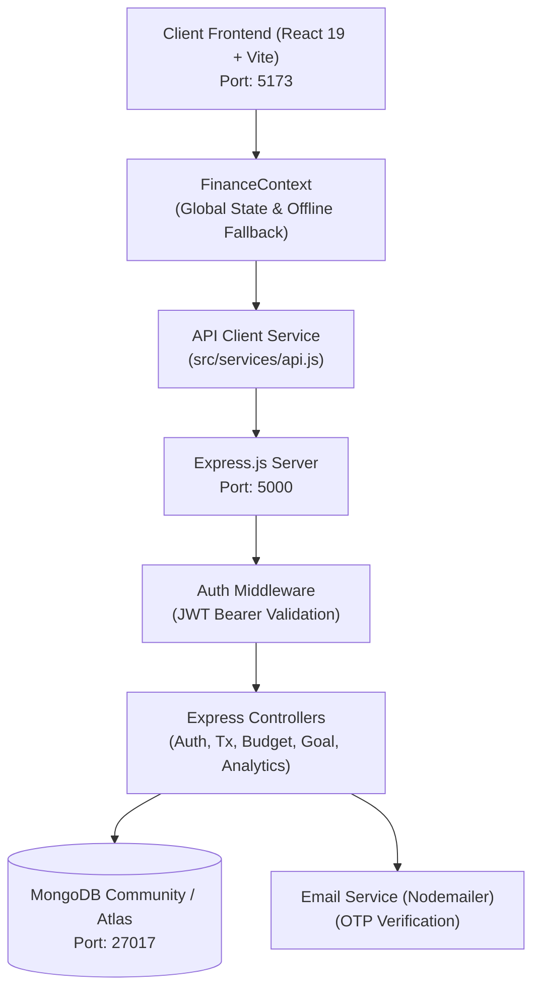

# ⚡ FinPulse (FinTrack) - Personal Finance & Wealth Intelligence Platform

> **FinPulse** is a modern, full-stack personal finance management and intelligence web application built with **React 19**, **Node.js/Express**, and **MongoDB**. It delivers real-time expense tracking, automated budget threshold alerts, savings goal milestone tracking, recurring subscription monitoring, statistical anomaly detection, dynamic financial health scoring, and predictive spending forecasting.

---

## 📑 Table of Contents

1. [Project Overview](#-project-overview)
2. [Key Highlights & Architecture](#-key-highlights--architecture)
3. [Technology Stack](#-technology-stack)
4. [System Architecture](#-system-architecture)
5. [Complete Feature Modules](#-complete-feature-modules)
6. [Data Models & Schema Design](#-data-models--schema-design)
7. [API Endpoints Reference](#-api-endpoints-reference)
8. [Algorithms & Business Logic](#-algorithms--business-logic)
9. [Project Directory Structure](#-project-directory-structure)
10. [Setup & Installation Guide](#-setup--installation-guide)
11. [Environment Variables](#-environment-variables)
12. [Demo Account & Seed Data](#-demo-account--seed-data)
13. [Security & Authentication](#-security--authentication)

---

## 🌟 Project Overview

Managing personal finances across multiple payment methods (UPI, Cards, Bank Transfers, Cash) is challenging. Most expense trackers are either static spreadsheets or rigid manual ledgers. **FinPulse** bridges this gap by combining traditional ledger tracking with automated intelligence:

- **Unified Cash Flow Dashboard:** Real-time visibility of total balance, monthly inflows, outflows, and net savings.
- **Dynamic Financial Health Score (0–100):** Evaluates spending velocity, budget discipline, savings rate, and subscription ratios.
- **Statistical Anomaly Detection:** Flags unexpected high-value transactions using statistical deviation from personal benchmarks.
- **Smart Insights & Forecasting:** Provides behavioral spending tips and projects month-ahead cashflow.
- **Hybrid Data Resilience:** Seamlessly functions with the **MongoDB** backend while offering automatic fallback to local client storage if the backend or database is offline.

---

## 🚀 Key Highlights & Architecture

- **Full MERN Stack:** React 19 Frontend + Express.js Backend + MongoDB with Mongoose ODM.
- **Hybrid Persistence Layer:** If MongoDB is connected, all operations sync in real time. If the backend is unreachable, FinPulse operates seamlessly in Local Storage mode without crashing.
- **Complete Auth Suite:**
  - Standard Email & Password registration with bcrypt hashing.
  - One-click Google Authentication with user auto-provisioning.
  - 6-digit Email OTP Password Reset with TTL expiration and Nodemailer SMTP delivery.
- **Dynamic Visualizations:** Powered by **Recharts** (Area charts, Bar comparisons, Donut breakdowns, and SVG Radial gauges).
- **Dark / Light Theme:** Modern dark theme by default with full CSS custom property variables and instant toggle.

---

## 🛠️ Technology Stack

### Frontend
- **Framework:** [React 19.2.8](https://react.dev/) + [Vite 8.2](https://vitejs.dev/)
- **Routing:** [React Router DOM v7](https://reactrouter.com/)
- **Charts & Data Visualization:** [Recharts 3.10](https://recharts.org/)
- **Icons:** [Lucide React](https://lucide.dev/)
- **Styling:** Custom Modular Vanilla CSS Design System with CSS Variables, Glassmorphism, and Fluid Flex/Grid layouts.
- **Linter:** [Oxlint](https://oxc.rs/)

### Backend
- **Runtime:** [Node.js](https://nodejs.org/) (ES Modules `type: "module"`)
- **Web Framework:** [Express.js 4.21](https://expressjs.com/)
- **Database:** [MongoDB](https://www.mongodb.com/) via [Mongoose 8.10](https://mongoosejs.com/)
- **Authentication:** [JSON Web Tokens (jsonwebtoken 9.0)](https://jwt.io/) & [Bcrypt.js 3.0](https://github.com/dcodeIO/bcrypt.js)
- **Mailing Service:** [Nodemailer 10.0](https://nodemailer.com/) (Gmail SMTP & Ethereal test accounts)
- **CORS & Environment:** `cors 2.8`, `dotenv 16.4`, `nodemon 3.1`

---

## 🏛️ System Architecture



---

## 📦 Complete Feature Modules

### 1. 📊 Dashboard (`/dashboard`)
- 4 High-level Stat Cards: Available Balance, Monthly Income, Monthly Expenses, Monthly Savings.
- Active Anomaly Alert Banner with instant resolve/dismiss controls.
- Monthly Cash Flow Overview (Income vs Expense bar/area chart).
- Radial Financial Health Score gauge with status badge.
- Expense Breakdown Category Donut Chart.
- Top actionable Smart Insights summaries.

### 2. 💳 Transactions Management (`/transactions`)
- Complete ledger table supporting **Income** and **Expense** entry.
- Real-time search by transaction name, merchant, or notes.
- Multi-dimensional filters: Type (Income/Expense), Category, Payment Method (UPI, Card, Bank Transfer, Cash), Amount Range (Min/Max), and Date Range.
- Sort by Date (newest/oldest) or Amount (highest/lowest).
- In-place Edit Modal and deletion with budget recalculation.
- One-click CSV ledger export.
- Quick Modals for **Add Expense** and **Add Income**.

### 3. 🎯 Budgets & Threshold Guard (`/budgets`)
- Category-level monthly spending limits (Food, Transport, Shopping, Bills, Entertainment, etc.).
- Custom alert threshold triggers (e.g., alert at 80% utilization).
- Visual progress bars with dynamic status indicators:
  - 🟢 **Healthy** (<80%)
  - 🟡 **Approaching Limit** (80% - 99%)
  - 🔴 **Exceeded** (>=100%)
- Real-time notification generation when spending breaches threshold limits.

### 4. 🏆 Savings Goals (`/savings-goals`)
- Goal tracker for long-term aspirations (Laptop, Emergency Fund, Vacation, etc.).
- Target amount, current amount saved, target deadline, and remaining buffer.
- Quick deposit modal: "Add Money to Goal" automatically deducts from balance, creates an associated transaction, updates the progress bar, and triggers celebration notifications.

### 5. 🔄 Subscriptions & Recurring Bills (`/subscriptions`)
- Tracks recurring monthly and yearly services (Netflix, Spotify, Cloud Storage, Broadband).
- Displays total monthly subscription expense and annual projected commitments.
- Automated **Upcoming Renewal Alert**: Highlights subscriptions due within 48 hours.
- Direct subscription cancellation or registration.

### 6. 📈 Advanced Analytics (`/analytics`)
- Historical cashflow trend comparison across past 5 months.
- Daily spending velocity chart for the current month.
- Highest spending category spotlight and average daily burn rate.
- Savings rate calculation (% of income retained).

### 7. 💡 Smart Insights Engine (`/smart-insights`)
- Rule-based financial advisor analyzing current spending behavior:
  - Food delivery spikes (e.g. Swiggy/Zomato vs previous baseline).
  - Unused or high-ratio recurring subscriptions.
  - Savings growth opportunities and optimal monthly allocations.
  - Direct deep-links to relevant pages for immediate remediation.

### 8. 🩺 Financial Health Index (`/financial-health`)
- Computes an overall score from 0 to 100 based on 5 weighted pillars:
  1. **Budget Discipline (25%):** Limit adherence.
  2. **Savings Rate (25%):** Income saved ratio.
  3. **Spending Control (20%):** Discretionary velocity.
  4. **Subscription Management (15%):** Fixed commitments load.
  5. **Expense Consistency (15%):** Month-over-month stability.
- Actionable tips to elevate score standing (e.g., from "Good Standing" to "Excellent").

### 9. 🔮 Spending Forecast (`/spending-forecast`)
- Month-ahead cash flow prediction.
- Projected inflows, outflows, expected savings, and anticipated savings rate changes.
- Predictive warnings for seasonal shifts, recurring renewals, and holiday adjustments.

### 10. 📄 Reports & Ledger Export (`/reports`)
- Comprehensive August 2026 financial report sheet.
- Breakdown of largest expense, top category, net savings rate, and category distribution table.
- PDF and CSV statement export capabilities.

### 11. 🔔 Notifications & Alerts Center (`/notifications`)
- Central notification feed with severity indicators (Danger, Warning, Success, Info).
- Filter by All / Unread.
- Mark individual as read/unread, delete, or mark all as read.

### 12. 👤 Profile & ⚙️ Settings (`/profile`, `/settings`)
- User profile editing: Name, Phone, Default Currency, Monthly Income, Financial Goals.
- Security: Change password with old password verification.
- Appearance: Dark Mode / Light Mode instant theme switcher.
- Session Management: Clean token logout.

---

## 🗄️ Data Models & Schema Design

FinPulse models are organized under `server/models/`:

### 1. `User.js`
| Field | Type | Required | Description |
|---|---|---|---|
| `name` | String | Yes | User's full name |
| `email` | String | Yes (Unique) | Normalized lowercase email |
| `password` | String | Yes | Bcrypt-hashed password |
| `currency` | String | No | Default currency (`INR`, `USD`, `EUR`, etc.) |
| `monthlyIncome` | Number | No | Monthly baseline income |
| `phone` | String | No | Contact number |
| `financialGoals` | String | No | High-level personal goals summary |

### 2. `Transaction.js`
| Field | Type | Default | Description |
|---|---|---|---|
| `userId` | ObjectId | Ref: User | Account owner |
| `description` | String | - | Merchant or transaction title |
| `amount` | Number | - | Transaction amount |
| `type` | String | `'expense'` | `'income'` or `'expense'` |
| `category` | String | `'Other'` | Category tag (Food, Transport, Bills, etc.) |
| `date` | String | Current ISO | Format: `YYYY-MM-DD` |
| `paymentMethod`| String | `'UPI'` | `UPI`, `Card`, `Bank Transfer`, `Cash` |
| `notes` | String | `''` | Optional extra notes |

### 3. `Budget.js`
| Field | Type | Default | Description |
|---|---|---|---|
| `userId` | ObjectId | Ref: User | Account owner |
| `category` | String | - | Food, Transport, Bills, Shopping, etc. |
| `limit` | Number | - | Monthly cap amount |
| `threshold` | Number | `80` | Alert threshold percentage (e.g. 80%) |
| `startDate` | String | - | Start date of budget cycle |
| `endDate` | String | - | End date of budget cycle |

### 4. `Goal.js`
| Field | Type | Default | Description |
|---|---|---|---|
| `userId` | ObjectId | Ref: User | Account owner |
| `name` | String | - | Goal title (e.g., "Emergency Fund") |
| `target` | Number | - | Target savings amount |
| `saved` | Number | `0` | Current amount accumulated |
| `deadline` | String | - | Target date `YYYY-MM-DD` |
| `notes` | String | `''` | Extra goal details |

### 5. `Subscription.js`
| Field | Type | Default | Description |
|---|---|---|---|
| `userId` | ObjectId | Ref: User | Account owner |
| `name` | String | - | Subscription provider name |
| `cost` | Number | - | Cost per cycle |
| `billingCycle`| String | `'monthly'`| `'monthly'` or `'yearly'` |
| `category` | String | `'Bills'` | Category allocation |
| `nextPayment` | String | - | Next charge date `YYYY-MM-DD` |
| `status` | String | `'active'` | `'active'` or `'cancelled'` |

### 6. `Notification.js`
| Field | Type | Default | Description |
|---|---|---|---|
| `userId` | ObjectId | Ref: User | Account owner |
| `title` | String | - | Notification title |
| `message` | String | - | Detailed body message |
| `type` | String | `'info'` | `'info'`, `'warning'`, `'danger'`, `'success'` |
| `read` | Boolean | `false` | Read status |

### 7. `Otp.js`
| Field | Type | Default | Description |
|---|---|---|---|
| `email` | String | - | Lowercase recipient email |
| `otp` | String | - | 6-digit generated numeric code |
| `expiresAt` | Date | +10 mins | MongoDB TTL index (`expires: '10m'`) |

---

## 🔌 API Endpoints Reference

All endpoints are hosted under `http://localhost:5000/api`.

### 1. Health
- `GET /api/health` — Service uptime, database connectivity state, and timestamp.

### 2. Authentication & Profile (`/api/auth`)
- `POST /api/auth/register` — Create new user + auto-seed starter demo data.
- `POST /api/auth/login` — Authenticate email/password & receive JWT.
- `POST /api/auth/google` — Authenticate/provision Google profile.
- `POST /api/auth/send-otp` — Generate & send 6-digit email reset code.
- `POST /api/auth/reset-password` — Verify OTP & update user password.
- `GET /api/auth/profile` *(Protected)* — Get authenticated profile info.
- `PUT /api/auth/profile` *(Protected)* — Update profile attributes and password.

### 3. Transactions (`/api/transactions`) *(Protected)*
- `GET /api/transactions` — List user transactions (supports `?limit=&type=&category=`).
- `POST /api/transactions` — Create a new transaction.
- `PUT /api/transactions/:id` — Update transaction details.
- `DELETE /api/transactions/:id` — Delete a transaction.

### 4. Budgets (`/api/budgets`) *(Protected)*
- `GET /api/budgets` — List user budgets.
- `POST /api/budgets` — Create new category budget.
- `PUT /api/budgets/:id` — Update budget limit or threshold.
- `DELETE /api/budgets/:id` — Remove a budget.

### 5. Savings Goals (`/api/goals`) *(Protected)*
- `GET /api/goals` — List user goals.
- `POST /api/goals` — Create new savings goal.
- `PUT /api/goals/:id` — Edit goal information.
- `POST /api/goals/:id/deposit` — Deposit money into a goal.
- `DELETE /api/goals/:id` — Remove a goal.

### 6. Subscriptions (`/api/subscriptions`) *(Protected)*
- `GET /api/subscriptions` — List active/cancelled subscriptions.
- `POST /api/subscriptions` — Add a recurring subscription.
- `DELETE /api/subscriptions/:id` — Remove a subscription.

### 7. Notifications (`/api/notifications`) *(Protected)*
- `GET /api/notifications` — List all notifications.
- `PUT /api/notifications/:id/read` — Mark notification as read/unread.
- `PUT /api/notifications/read-all` — Mark all as read.
- `DELETE /api/notifications/:id` — Delete notification.

### 8. Analytics (`/api/analytics`) *(Protected)*
- `GET /api/analytics/summary` — Aggregated Income, Expense, Savings, Balance.
- `GET /api/analytics/categories` — Category-wise spending breakdown with totals.
- `GET /api/analytics/monthly-trends` — Reshaped monthly income/expense trends.
- `GET /api/analytics/anomalies` — Statistical anomaly detection list.

---

## 🧠 Algorithms & Business Logic

### 1. Statistical Anomaly Detection
Uses MongoDB Aggregation on the user's historical expense distribution:
$$\mu = \text{Average Transaction Amount}, \quad \sigma = \text{Standard Deviation}$$
$$\text{Anomaly Threshold} = \mu + 1.5\sigma$$
Any transaction where $\text{amount} \ge \text{Threshold}$ is flagged with an 88% confidence score for user verification.

### 2. Dynamic Budget Guard & Alerts
Whenever an expense is logged or modified:
$$\text{Utilization \%} = \left(\frac{\sum \text{Expenses in Category}}{\text{Budget Limit}}\right) \times 100$$
- If $\ge 100\%$: Instantly fires a **Danger** notification ("Exceeded Budget").
- If $\ge \text{Threshold}$ (default 80%): Fires a **Warning** notification ("Approaching Budget").

### 3. Financial Health Scoring Index
Calculated dynamically out of 100 based on weighted metrics:
1. **Budget Discipline (25 pts):** Proportion of categories within budget limits.
2. **Savings Rate (25 pts):** $\min(25, (\text{Savings} / \text{Income}) \times 50)$.
3. **Discretionary Spending Velocity (20 pts):** Control over Food & Shopping.
4. **Subscription Load (15 pts):** Fixed subscriptions as percentage of total outflow.
5. **Volatility Consistency (15 pts):** Uniformity across daily ledger events.

---

## 📁 Project Directory Structure

```text
FinPulse/
├── package.json                 # Frontend dependencies and root scripts
├── vite.config.js               # Vite build configuration
├── index.html                   # HTML5 template entry point
├── start-all.bat                # Windows one-click launcher for Frontend + Backend
├── start-mongo.bat              # Windows launcher for local MongoDB daemon
│
├── server/                      # Express.js REST API Backend
│   ├── package.json             # Backend dependencies & scripts
│   ├── server.js                # Express app entry point & route registration
│   ├── seeder.js                # Database seeder (seed and destroy commands)
│   ├── .env                     # Backend environment configuration
│   ├── config/
│   │   └── db.js                # Mongoose connection & connection state helpers
│   ├── controllers/             # Business logic controllers
│   │   ├── authController.js
│   │   ├── transactionController.js
│   │   ├── budgetController.js
│   │   ├── goalController.js
│   │   ├── subscriptionController.js
│   │   ├── notificationController.js
│   │   └── analyticsController.js
│   ├── middleware/
│   │   ├── authMiddleware.js    # JWT verification guard
│   │   └── errorMiddleware.js   # 404 handler and error response formatter
│   ├── models/                  # Mongoose Schema definitions
│   │   ├── User.js
│   │   ├── Transaction.js
│   │   ├── Budget.js
│   │   ├── Goal.js
│   │   ├── Subscription.js
│   │   ├── Notification.js
│   │   └── Otp.js
│   └── utils/
│       └── emailService.js      # Nodemailer SMTP with branded HTML template
│
└── src/                         # React Frontend Application
    ├── main.jsx                 # React root mount
    ├── App.jsx                  # Route definitions and ProtectedLayout wrapper
    ├── index.css                # Global CSS design tokens, themes & component styles
    ├── context/
    │   └── FinanceContext.jsx   # Global state, MongoDB sync & offline fallback
    ├── services/
    │   └── api.js               # REST client abstraction with fetch
    ├── components/              # 24 Modular Reusable UI Components
    │   ├── Navbar.jsx           # Header bar with user menu & search
    │   ├── Sidebar.jsx          # Collapsible navigation drawer
    │   ├── StatCard.jsx         # Metric display card
    │   ├── TransactionTable.jsx # Advanced data table with search, filter, sort
    │   ├── SpendingChart.jsx    # Monthly comparison visualizer
    │   ├── ExpenseBreakdown.jsx # Category donut visualizer
    │   ├── FinancialHealthCard.jsx # Radial score card
    │   ├── AnomalyCard.jsx      # High-expense warning banner
    │   ├── InsightCard.jsx      # Actionable behavioral card
    │   ├── SavingsGoalCard.jsx  # Goal milestone progress card
    │   ├── SubscriptionCard.jsx # Recurring subscription card
    │   ├── NotificationCard.jsx # Dismissible notification card
    │   ├── QuickActionBtn.jsx   # Floating Action Button (FAB)
    │   ├── GoogleAuthModal.jsx  # Interactive Google login popup
    │   ├── ForgotPasswordModal.jsx # Multi-step OTP reset modal
    │   ├── AddExpenseModal.jsx  # Expense entry modal
    │   ├── AddIncomeModal.jsx   # Income entry modal
    │   ├── AddBudgetModal.jsx   # Budget creation modal
    │   ├── AddGoalModal.jsx     # Goal creation modal
    │   ├── AddSubscriptionModal.jsx # Subscription creation modal
    │   ├── Modal.jsx            # Base reusable dialog
    │   ├── ProgressBar.jsx      # Animated percentage bar
    │   └── Toast.jsx            # Toast container & message pill
    └── pages/                   # 15 Complete Application Views
        ├── Dashboard.jsx
        ├── Transactions.jsx
        ├── Budgets.jsx
        ├── SavingsGoals.jsx
        ├── Subscriptions.jsx
        ├── Analytics.jsx
        ├── SmartInsights.jsx
        ├── FinancialHealth.jsx
        ├── Forecast.jsx
        ├── Reports.jsx
        ├── Notifications.jsx
        ├── Profile.jsx
        ├── Settings.jsx
        ├── Login.jsx
        └── Signup.jsx
```

---

## ⚡ Setup & Installation Guide

### Prerequisites
- [Node.js](https://nodejs.org/) (v18 or higher recommended)
- [MongoDB Community Server](https://www.mongodb.com/try/download/community) installed locally OR a [MongoDB Atlas](https://www.mongodb.com/atlas) cloud URI.

### Step 1: Install Dependencies
Open a terminal in the project root:
```bash
# Install frontend dependencies
npm install

# Install backend dependencies
cd server
npm install
cd ..
```

### Step 2: Configure & Start MongoDB
- Set your `MONGO_URI` in `.env` (or `server/.env`).
  - **Local MongoDB**: `mongodb://127.0.0.1:27017/fintrack`
  - **MongoDB Atlas**: `mongodb+srv://<username>:<password>@cluster0.xxxxx.mongodb.net/fintrack?retryWrites=true&w=majority`
- If using local MongoDB on Windows:
```bash
# Option A: Run the provided batch file
start-mongo.bat

# Option B: Or start mongod directly
mongod --dbpath="C:\Users\<YourUser>\mongodb-data"
```

### Step 3: Test MongoDB Connection
Verify that your connection string in `.env` connects successfully:
```bash
npm run server:test-db
```

### Step 4: Seed Initial Demo Data
To populate the database with a pre-configured demo account and sample transactions, budgets, goals, and subscriptions:
```bash
npm run server:seed
```

### Step 5: Run the Application
You can run both servers simultaneously using the provided batch launcher:
```bash
start-all.bat
```

Or run them in separate terminal tabs:
```bash
# Terminal 1: Backend Server (Port 5000)
npm run server

# Terminal 2: Frontend App (Port 5173)
npm run dev
```

Visit **`http://localhost:5173`** in your browser.

---

## 🔐 Environment Variables

The backend configuration is stored in `.env` (in the project root or `server/.env`):

```env
PORT=5000
NODE_ENV=development

# Local MongoDB (default)
MONGO_URI=mongodb://127.0.0.1:27017/fintrack

# Or Cloud MongoDB Atlas:
# MONGO_URI=mongodb+srv://<user>:<password>@cluster0.xxxxx.mongodb.net/fintrack?retryWrites=true&w=majority

# JWT secret key for session signing
JWT_SECRET=fintrack_jwt_super_secret_key_2026

# Optional: Real Gmail / SMTP delivery for password reset OTPs
# EMAIL_SERVICE=gmail
# EMAIL_USER=your_email@gmail.com
# EMAIL_PASS=your_16_letter_app_password
```

> **Note on Email OTP:** If `EMAIL_USER` is omitted, FinPulse automatically generates an Ethereal test inbox link and displays the OTP directly in the frontend modal during development.

---

## 👤 Demo Account & Seed Data

| Attribute | Demo Account Value |
|---|---|
| **Email** | `sredivit@finpulse.ai` |
| **Password** | `password123` |
| **Name** | Sredivit |
| **Monthly Income** | ₹50,000 |
| **Currency** | INR (₹) |
| **Transactions** | 16 realistic transactions (Swiggy, Zomato, Uber, Amazon, Netflix, Bills) |
| **Budgets** | Food (₹5k), Transport (₹3k), Shopping (₹4k), Bills (₹5k), Entertainment (₹2.5k) |
| **Goals** | New Laptop (₹80k), Emergency Fund (₹100k), Vacation (₹50k) |
| **Subscriptions**| Netflix, Spotify, Broadband Internet, iCloud Storage |

---

## 🔒 Security & Authentication

1. **Password Hashing:** Passwords are encrypted with a 10-round salt using `bcryptjs` before storage in MongoDB.
2. **Token Security:** Authenticated requests transmit an `Authorization: Bearer <token>` JWT header with a 30-day expiration window.
3. **Protected Layout:** React Router routes are guarded by `<ProtectedLayout />`; unauthenticated visitors are automatically routed to `/login`.
4. **Time-Limited OTPs:** Password reset codes expire in 10 minutes via MongoDB TTL indexes and are invalidated immediately upon first use.
5. **CORS Safe:** Express server applies configurable CORS rules for cross-origin security between ports 5173 and 5000.
